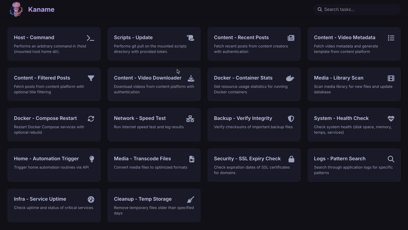
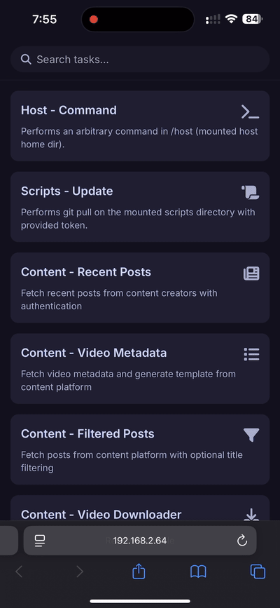

<div align="center">
  
  <h1>Kaname</h1>

  <a href="https://github.com/tanq16/kaname/actions/workflows/release.yml"></a>&nbsp;<a href="https://github.com/Tanq16/kaname/releases"></a>&nbsp;<a href="https://hub.docker.com/r/tanq16/kaname"></a><br><br>
</div>

A simple, self-hosted, and elegant web-based UI for running your predefined scripts. Kaname is designed for those who need a straightforward way to execute tasks on a server without exposing SSH or dealing with command-line interfaces.

The goal of the application is to provide a clean and modern interface for triggering scripts written in Bash or Python. You define your tasks and their parameters in a simple JSON file, and Kaname presents them as interactive cards in a beautiful UI. It's geared specifically towards homelabs. Here are some main points:

- **Ease of Use**: We all have scripts we have already written and collected, but converting them to tools or processes in workflow orchestrators like n8n can be quite hard. Kaname is much simpler to operate in a BYOS (bring your own script) manner.
- **Defining Scripts**: Scripts can be considered as tasks defined in your own repo/directory which you maintain. Just add 2 files - `cold-start.sh` (used to setup the Docker container for your dependencies) and `commands.json` (define your commands as tasks with parameters).
- **Custom Inputs**: Kaname supports 3 kinds of inputs - `checkbox` (boolean), `list` (comma-separated strings), `text` (string). Ensure your scripts conform to input parameters of these types. This is generally very simple to do with `argparse` for Python and a custom parser in Bash. See the [templates](/templates/) directory for sample Bash, Python, and ColdStart scripts.
- **Contained Python Environment**: Kaname's container is an `ubuntu:jammy` image with Python pre-installed. All dependencies should be installed into a `venv` within the `/app/scripts` directory (your repo of scripts which you will mount). Ensure you have `venv` in a `.gitignore`. (remember, it's `venv`, not `.venv`).
- **Environment Variables**: Kaname supports using secrets via environment variables that can be used as parameter values. You can put the secrets inside a `.env` file in you scripts repo, which will be automatically loaded by kaname when you mount your scripts directory. These variables can be used as `$VAR` within parameters.
- **Web Application**: The strength of Kaname lies in the fact that standard error and standard output are both shown on the web UI for your custom-argument scripts. This means they can even be triggered from a smartphone.

Kaname features a beautiful Catppuccin Mocha theme for a modern task runner interface. Tasks are dynamically loaded from a `commands.json` file, making configuration simple and centralized. Kaname can also be run as a binary, however, it is recommended to run it as a container.

## Screenshots

| Desktop View | Mobile View |
| --- | --- |
|  |  |

## Usage

The simplest way to run Kaname is with Docker, which ensures the correct directory structure for scripts.

```bash
# Create a directory to hold your scripts and configuration
mkdir -p $HOME/kaname/scripts
```

Place your `commands.json`, scripts, and `cold-start.sh` inside $HOME/kaname/scripts `cold-start.sh` is not a requirement, but recommended for container setup.

```bash
docker run --rm -d --name kaname \
  -p 8080:8080 \
  -v $HOME/kaname/scripts:/app/scripts \
  tanq16/kaname:main
```

The application will be available at `http://localhost:8080` (or your server IP). You can also use the following compose file:

```yaml
services:
  kaname:
    image: tanq16/kaname:main
    container_name: kaname
    volumes:
      - /path/to/your/scripts:/app/scripts # Change as needed
    ports:
      - 8080:8080
```

To use the binary, download the latest version (only built for AMD64) from the project releases. Ensure requirements and create the `/app/scripts` path.

Kaname is configured via a single `commands.json` file placed in your scripts directory. This file contains an array of command objects. Here is an example of a command definition:

```json
[
  {
    "id": "python-task-example",
    "name": "Sample Python Task",
    "description": "An example task that runs a Python script with parameters.",
    "script_path": "/app/scripts/your-script.py",
    "script_type": "python",
    "icon": "fa-brands fa-python",
    "parameters": [
      {
        "name": "--input-file",
        "label": "Input File Path",
        "type": "text",
        "required": true,
        "default": "/app/data/default.txt"
      },
      {
        "name": "--verbose",
        "label": "Enable Verbose Logging",
        "type": "checkbox",
        "required": false,
        "default": false
      }
    ]
  }
]
```

> [!NOTE]
> You can use any Font Awesome icon class for the `icon` field. Also, the `name` of a parameter should match the command-line flag your script expects (e.g., `--input-file`).
